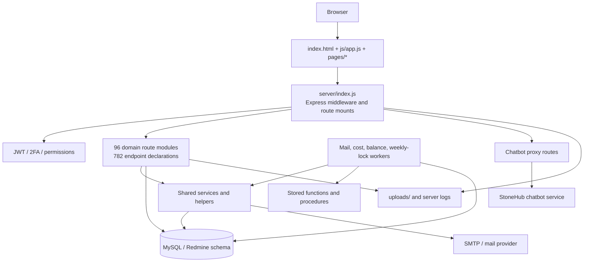
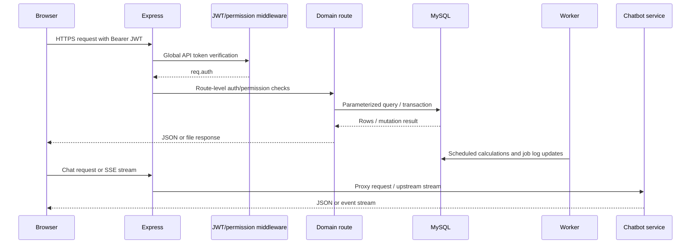

# System Architecture

## System Overview

Jarvis is a single Node.js process containing an Express HTTP server, static-file hosting, direct MySQL access, background workers, and outbound proxy clients. The frontend is not compiled by a framework build; it is served as static HTML/CSS/JavaScript. Domain boundaries are represented primarily by route filenames, page directories, database table prefixes, and a small set of services rather than separate deployable packages.

## Architecture Diagram

## Component Descriptions

| Component | Purpose | Dependencies | Type |
|---|---|---|---|
| `index.html`, `login.html`, `js/*`, `pages/*`, `css/*` | Static SPA shell and module UIs | Browser APIs, `/api`, `/chatbot-api`, `/chatbot-admin-api` | Application frontend |
| `server/index.js` | HTTP server, static hosting, global API auth guard, route composition, startup migration guards, worker startup | Express, JWT, DB, all routes/workers | Application backend |
| `server/routes/*` | Domain HTTP APIs and business workflows | `server/db.js`, middleware, services, helpers, MySQL | Application backend |
| `server/middleware/*` | JWT authentication and form/action authorization | JWT, DB, permission helper | Shared backend |
| `server/services/*` | Cross-domain orchestration and reusable business logic | DB, SMTP, crypto, calendar generation | Shared backend |
| `server/workers/*` | In-process asynchronous jobs and scheduled calculations | node-cron, DB, services, stored procedures | Operations |
| `server/db.js` | MySQL pool, parameterized query wrapper, transactions, environment switching | `mysql2`, dotenv | Data access |
| `deploy/01_schema/*` | Baseline MySQL/Redmine-compatible schema | MySQL | Infrastructure/data |
| `deploy/02_routines/*` | Encryption, working-time, ERP, cost, and salary-related stored routines | MySQL | Infrastructure/data |
| `deploy/03_seed/*` | Initial groups, permissions, workflows, parameters, and actions | MySQL | Infrastructure/data |
| `server/migrations/*`, `deploy/migrate.js` | Incremental schema/data migration execution | MySQL, Node.js | Infrastructure |
| `server/routes/chatbot-*.js` | JSON, multipart, download, and SSE proxy to external chatbot | `fetch`, external service | Integration |

## Data Flow

## Integration Points

- **MySQL/Redmine database**: Primary source of users, HR data, Redmine records, projects, financial records, workflow configuration, and operational tables.
- **StoneHub chatbot service**: Default URL is `https://stonehub-dc.goline.vn`; configured through `CHATBOT_SERVICE_URL` and used by both employee chat and admin proxy routes.
- **SMTP/mail service**: `nodemailer`-based mail service and `mt_mail_request` queue support OTP, workflow, report, and template-driven email.
- **Redmine API**: Optional configuration is present in `.env.example`; static inspection did not identify a standalone Redmine HTTP client in the current server code.
- **Local filesystem**: Uploaded files are exposed under `/uploads`; worker logs are written under `server/logs` when jobs run.

## Infrastructure Components

- Deployment is script-based (`deploy/setup.sh`, `deploy/auto-deploy.sh`, `deploy/migrate.js`); no Docker, Kubernetes, Terraform, CloudFormation, or CI configuration was found.
- The server binds to `0.0.0.0` by default and expects a reverse proxy or deployment environment to provide TLS and process supervision.
- Workers run in the web process and can be disabled with `WORKERS_ENABLED=false`.
- Database switching supports local/development and production-debug targets through `.env.development` and `.env.proddebug`; this is explicitly gated in the dev-env route but increases the importance of deployment isolation.
