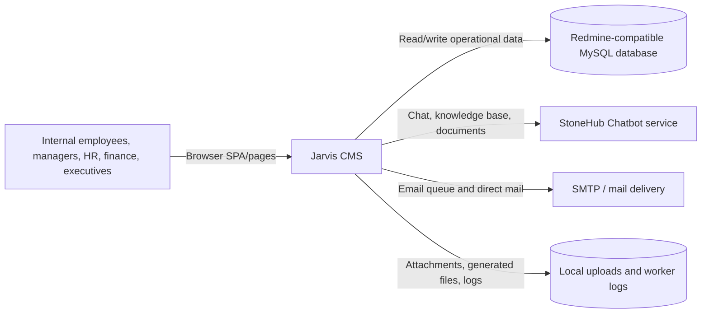

# Business Overview

## Business Context Diagram

## Business Description

Jarvis is an internal operations platform for Goline. It provides one browser-based workspace over an existing Redmine/MySQL data model and adds business modules for people operations, project delivery, finance, approvals, learning, communication, and management reporting.

The system is not a content-management system in the narrow sense. It is an ERP/CRM-style internal management application with a static multi-page frontend, an Express API, MySQL stored routines, background workers, and a proxied chatbot capability.

## Business Transactions

| Transaction | Business purpose | Main areas |
|---|---|---|
| Authenticate and establish 2FA | Validate employee credentials and issue a JWT session | Auth, HR employee records, email/TOTP |
| Manage workforce records | Maintain employees, positions, contracts, qualifications, assets, leave, requests, bonuses, salary, and evaluations | HR, salary |
| Plan and deliver projects | Manage projects, teams, stakeholders, resources, risks, quality, change, communications, tasks, costs, payments, commissions, and weekly reports | Project management |
| Process approvals | Route requests through configurable multi-step workflows and record approve/reject/pay/complete actions | Approval engine, HR, PM, finance |
| Manage company finance | Maintain accounts, mappings, transactions, transfers, balances, monthly budgets, cost allocation, and salary advances | Accounting, budget, project cost |
| Operate shared services | Manage mail templates/requests, announcements, wiki, suppliers, products, assets, rooms, meetings, and parameters | Master data, facility |
| Develop employee capability | Maintain skills, profiles, lessons, exams, sessions, attempts, and coverage reports | Training |
| Use internal knowledge assistant | Chat with knowledge bases and administer documents, chunks, Q&A, suggestions, and sessions | Chatbot |
| Run scheduled calculations | Recalculate cost, lock weekly cost, snapshot account balances, and send queued mail | Workers and stored procedures |

## Business Dictionary

- **Member/login**: The employee identifier shared across Redmine users and HR employee records.
- **Form code**: Permission-controlled business screen/module identifier, such as `projectmanagement`, `hr-leave`, or `monthly-budget`.
- **Effective group**: The set of user groups used to calculate a user's form/action permissions, including default-group fallback.
- **Approval instance**: A runtime approval process attached to a business object and workflow.
- **Project cost**: Labor and other project cost calculated from timesheet/member-cost data, with cache and lock behavior.
- **Salary-sensitive data**: Payroll, allowance, advance, bank, and related monetary fields, some stored encrypted or decrypted through MySQL routines.
- **Knowledge base (KB)**: A chatbot corpus selected for chat sessions or administration.

## Component-Level Business Descriptions

### Frontend shell and pages

Provides navigation, role-aware UI, forms, tables, dashboards, uploads, reports, and module-specific workflows. The app is predominantly static HTML/CSS/JavaScript loaded by `index.html` and `js/app.js`.

### Express API

Coordinates authentication, authorization, CRUD operations, reports, imports/exports, uploads, integrations, and manual worker triggers. Route handlers access MySQL directly through a shared query module.

### Domain services and workers

Centralize selected cross-cutting logic: approvals, account transactions, cost caching/locking, mail, calendar files, job logging, encryption, sanitization, and role/permission lookup. Workers execute asynchronous mail, cost, balance, and weekly-lock operations in the server process.

### MySQL/Redmine data layer

Stores the operational data and legacy Redmine entities. Deployment SQL supplies schemas, functions, procedures, permissions, approval workflows, and parameters; incremental migrations continue to evolve the database.

### Chatbot integration

Proxies employee chat and chatbot administration requests to the external StoneHub service, including JSON, multipart uploads, document downloads, and server-sent-event streaming.
