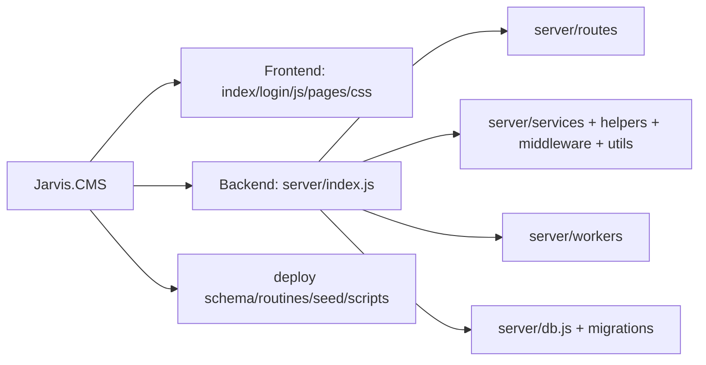

# Code Structure

## Build System

- **Type**: npm-managed Node.js application.
- **Runtime**: Node.js CommonJS modules; the current shell reports Node.js v22.14.0.
- **Entry point**: `server/index.js`.
- **Scripts**: `start`, `dev`, `client`, and `test:db` are declared in `package.json`.
- **Build behavior**: Static assets are served directly. `server/static-client.js` is the only identified client-side packaging/minification helper.
- **Validation**: No ESLint, Prettier, CI workflow, Dockerfile, or automated test suite was found. The declared `test:db` target points to `server/test-db.js`, which is absent.

## Module Hierarchy

## Existing Files Inventory by Area

| Area | Inventory | Purpose |
|---|---:|---|
| `server/routes` | 96 JS modules | REST-style APIs grouped by domain; 782 route declarations |
| `server/services` | 9 JS modules | Approval, accounting, cost, mail, calendar, and job orchestration |
| `server/workers` | 4 JS modules | Polling and scheduled background work |
| `server/middleware` | 3 JS modules | Global/route authentication and permissions |
| `server/helpers` | 2 JS modules | Group permissions and team hierarchy |
| `server/utils` | 6 JS modules | Encryption, sanitization, activity logging, role cache |
| `server/migrations` | 189 files | Incremental schema/data evolution and repair scripts |
| `pages` | 14 domain directories / 87 HTML files | Module-specific views and scripts |
| `js` | Shared app, runtime, login, chatbot, and vendor scripts | Frontend runtime and common utilities |
| `css` | 12 stylesheets | Shared layout, components, domain styling, vendor styling |
| `deploy` | 3 schema files, 2 routine files, 5 seed files, scripts | Baseline deployment and database initialization |

### Key Backend Files

- `server/index.js` — composition root, middleware ordering, API mounts, static hosting, startup checks, workers, and error handler.
- `server/db.js` — MySQL pool, parameterized `execute`, transaction helper, health check, and runtime DB switching.
- `server/routes/auth.js` — Redmine user password verification, JWT issuance, email/TOTP 2FA, admin 2FA operations, and permission lookup endpoints.
- `server/middleware/auth.js` — JWT verification and role enrichment from `hr_employees`.
- `server/middleware/require-perm.js` — form/action permission lookup and 30-second per-login cache.
- `server/services/approvalEngine.js` — configurable approval workflow orchestration.
- `server/services/account-transaction-service.js` — transaction creation and balance-chain recomputation.
- `server/utils/encryption.js` — AES-GCM application encryption using `ENCRYPTION_KEY`.
- `server/utils/html-sanitizer.js` — server-side HTML sanitization helper.
- `server/routes/chatbot-proxy.js` / `chatbot-admin-proxy.js` — external chatbot forwarding and SSE/multipart support.

### Frontend Domain Inventory

- `accounting`, `salary`, and `kpi-revenue` — financial and payroll views.
- `hr`, `profiles`, and `training` — employee lifecycle, capability, exams, and evaluation.
- `projects` and `reports` — project delivery, tasks, costs, dashboards, and reporting.
- `facility` and `documents` — office/facility operations and document surfaces.
- `settings` — permissions, parameters, workflows, master data, mail, wiki, and announcements.
- `chatbot` — chatbot end-user and administration pages.

## Design Patterns

### Route-per-domain modularization

- **Location**: `server/routes/*.js`.
- **Purpose**: Keep HTTP handlers separated by business area while composing them in `server/index.js`.
- **Tradeoff**: Many routes contain SQL and business rules directly, so domain logic and transport logic are frequently coupled.

### Shared query and transaction helpers

- **Location**: `server/db.js`.
- **Purpose**: Centralize pool creation, parameter binding, transactions, and environment selection.
- **Good practice**: The primary `query` helper calls `connection.execute(sql, params)` and a transaction helper commits/rolls back on callback success/failure.

### Form/action authorization

- **Location**: `server/middleware/require-perm.js`, `mt_form_permission`, `mt_form_action_permission`.
- **Purpose**: Map HTTP methods and explicit actions to configurable permission records.
- **Current state**: Global JWT auth is deny-by-default for `/api/*`; form/action guard coverage is applied to selected mounts, not uniformly as a named route policy.

### In-process scheduled workers

- **Location**: `server/workers/*`, started by `server/index.js`.
- **Purpose**: Execute mail polling and cost/balance jobs without a separate worker deployment.
- **Tradeoff**: Requires careful single-instance/process coordination and resilient job locking when horizontally scaled.

### Soft-delete/status lifecycle

- **Location**: Broadly used through `status != 9`, `status = 1`, and related status codes.
- **Purpose**: Preserve operational records while hiding inactive/deleted data.
- **Risk**: The status vocabulary is distributed across handlers and schema rather than centrally documented.

## Critical Dependencies

| Dependency | Declared version | Usage |
|---|---:|---|
| Express | `^4.18.2` | HTTP server and static hosting |
| mysql2 | `^3.6.5` | MySQL pool, queries, transactions |
| jsonwebtoken | `^9.0.3` | JWT issuance/verification |
| cors | `^2.8.5` | Origin allowlist and credentialed requests |
| multer | `^2.0.2` | Multipart upload handling |
| node-cron | `^4.2.1` | Worker scheduling |
| nodemailer | `^8.0.1` | SMTP mail delivery |
| otplib / qrcode | `^13.3.0` / `^1.5.4` | TOTP and QR setup |
| sanitize-html | `^2.17.5` | Server HTML sanitization |
| exceljs / xlsx | `^4.4.0` / `^0.18.5` | Spreadsheet import/export |
| sharp | `^0.34.5` | Image processing |
