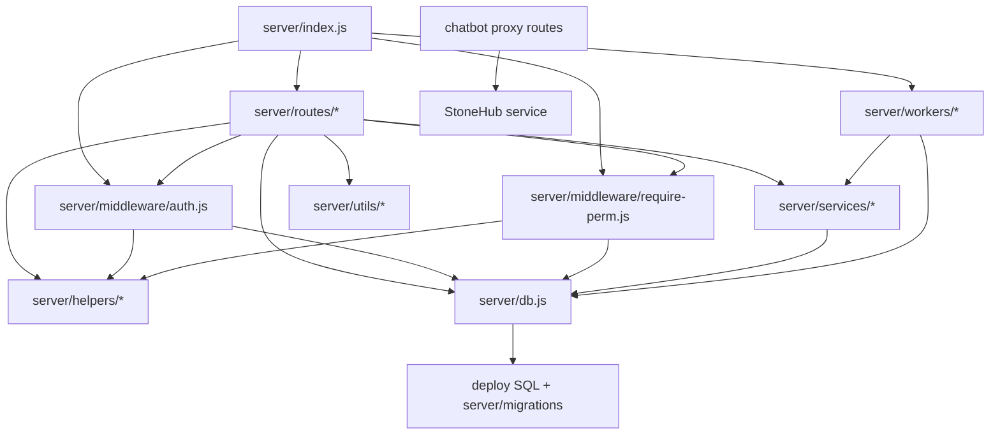

# Dependencies

## Internal Dependency Diagram

## Internal Dependencies

| Consumer | Dependency | Reason |
|---|---|---|
| All API routes | `server/db.js` | Direct SQL access and transaction execution |
| Protected routes | `auth.js`, `require-perm.js` | JWT identity and form/action authorization |
| Auth and permission middleware | `user-roles-cache.js`, `permission-helper.js`, `hr_employees`, group tables | Role and effective group resolution |
| Salary/advance/account routes | `encryption.js`, DB `fn_encrypt/fn_decrypt`, `account-transaction-service.js` | Sensitive values and financial balance effects |
| Approval-enabled routes | `approvalEngine.js` | Workflow loading and state transitions |
| Scheduled workers | `job-logger.js`, cost/balance/account services, DB procedures | Durable job audit and calculation |
| Frontend modules | `js/runtime-config.js`, `js/utils.js`, `/api/*` | Common fetch/auth/navigation behavior |

## External Dependencies

| Dependency | Version | Purpose | License status |
|---|---:|---|---|
| npm packages in `package.json` | See `technology-stack.md` | HTTP, database, crypto/auth, uploads, mail, spreadsheets, scheduling | Not independently verified in repository |
| MySQL/MariaDB/Redmine database | Environment-provided | Identity and operational data | External platform |
| StoneHub chatbot | Environment URL; default configured in source | Chat/RAG/admin operations | External service |
| SMTP provider | Environment/mail settings | OTP and business email | External service |

## Dependency Risks

- No lockstep contract exists between route handlers and clients; no OpenAPI or generated client is present.
- The server starts workers in-process, so process count directly affects duplicate scheduling and operational load.
- The application and SQL routines use different apparent encryption mechanisms/keys; this needs a single documented key-management design.
- The external chatbot proxy is a critical integration boundary but has no visible circuit breaker, timeout policy, or local authorization wrapper.
